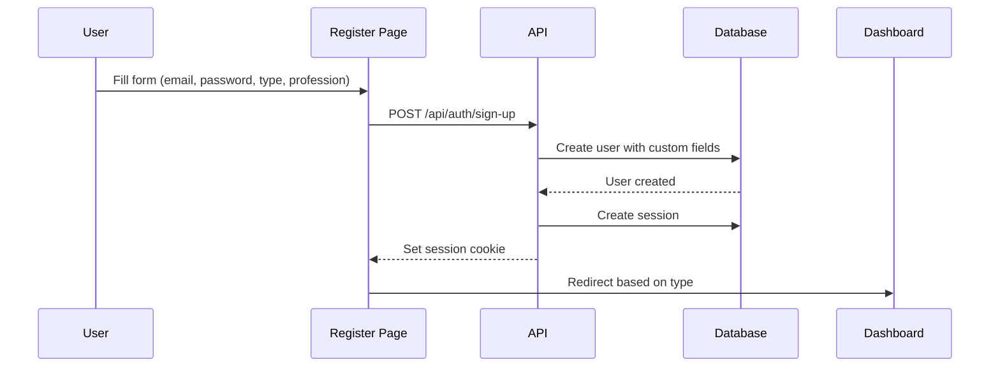
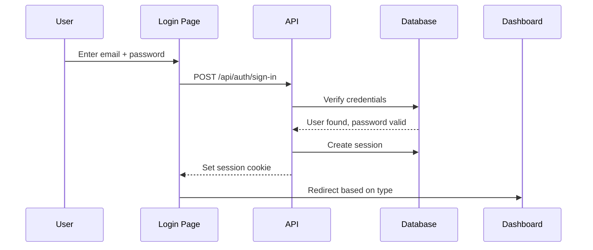

Biovity uses Better Auth for authentication, providing email/password login with custom user fields, rate limiting, and secure session management.

## Better Auth configuration

Authentication is configured in two files:

### Server configuration

```typescript title="lib/auth.ts"
import { betterAuth } from "better-auth"
import { pool } from "@/lib/db"

export const auth = betterAuth({
  database: pool,
  
  // Rate limiting for security
  rateLimit: {
    enabled: true,
    window: 60,     // 1 minute
    max: 10,        // 10 requests per minute per IP
  },
  
  advanced: {
    database: {
      generateId: () => crypto.randomUUID(),
    },
    useSecureCookies: process.env.NODE_ENV === "production",
  },
  
  emailAndPassword: {
    enabled: true,
  },
  
  logger: {
    level: process.env.NODE_ENV === "production" ? "error" : "debug",
  },
})
```

### Client configuration

```typescript title="lib/auth-client.ts"
import { createAuthClient } from "better-auth/react"
import { inferAdditionalFields } from "better-auth/client/plugins"

export const authClient = createAuthClient({
  baseURL: process.env.NEXT_PUBLIC_APP_URL || "http://localhost:3000",
  plugins: [
    inferAdditionalFields({
      user: {
        type: { type: "string", required: true },
        profession: { type: "string", required: true },
        avatar: { type: "string", required: false },
        isActive: { type: "boolean", required: false },
        organizationId: { type: "string", required: false },
      },
    }),
  ],
})

export const { useSession, signIn, signUp, signOut } = authClient
```

## Security features

<AccordionGroup>
  <Accordion title="Rate limiting">
    - 10 requests per minute per IP address
    - Prevents brute force attacks on login endpoints
    - Returns 429 Too Many Requests when exceeded
  </Accordion>

  <Accordion title="Secure cookies">
    - `useSecureCookies: true` in production (HTTPS only)
    - `httpOnly` cookies prevent XSS attacks
    - `sameSite: lax` prevents CSRF attacks
  </Accordion>

  <Accordion title="Session expiry">
    - Sessions expire after 7 days of inactivity
    - Sessions refresh after 1 day of activity
    - Automatic cleanup of expired sessions
  </Accordion>

  <Accordion title="Password hashing">
    - Better Auth uses bcrypt for password hashing
    - Salted hashes prevent rainbow table attacks
  </Accordion>
</AccordionGroup>

## Authentication flows

### Registration flow



#### Registration implementation

```tsx title="app/register/page.tsx"
import { signUp } from "@/lib/auth-client"

const handleSubmit = async (e: React.FormEvent) => {
  e.preventDefault()
  
  const { data, error } = await signUp.email({
    email,
    password,
    name,
    type,           // 'employee' or 'organization'
    profession,     // Required for employees
  })
  
  if (error) {
    // Handle error (duplicate email, weak password, etc.)
    return
  }
  
  // Redirect based on user type
  if (data.user.type === 'employee') {
    router.push('/dashboard/employee')
  } else {
    router.push('/dashboard/admin')
  }
}
```

### Login flow



#### Login implementation

```tsx title="app/login/page.tsx"
import { signIn } from "@/lib/auth-client"

const handleSubmit = async (e: React.FormEvent) => {
  e.preventDefault()
  
  const { data, error } = await signIn.email({
    email,
    password,
  })
  
  if (error) {
    // Handle error (invalid credentials, rate limit, etc.)
    return
  }
  
  // Redirect based on user type
  if (data.user.type === 'employee') {
    router.push('/dashboard/employee')
  } else {
    router.push('/dashboard/admin')
  }
}
```

### Logout flow

```tsx
import { signOut } from "@/lib/auth-client"

const handleLogout = async () => {
  await signOut()
  router.push('/login')
}
```

## Session management

### Session configuration

```typescript title="lib/auth.ts"
session: {
  modelName: "session",
  fields: {
    userId: "user_id",
    expiresAt: "expires_at",
    token: "token",
    ipAddress: "ip_address",
    userAgent: "user_agent",
    createdAt: "created_at",
    updatedAt: "updated_at",
  },
  expiresIn: 604800,        // 7 days
  updateAge: 86400,         // 1 day - sessions refresh after 1 day
  cookieCache: {
    enabled: true,
    maxAge: 300,            // 5 minutes
  },
}
```

### Session verification

#### Server-side (Server Component)

```tsx title="app/dashboard/employee/page.tsx"
import { auth } from "@/lib/auth"
import { headers } from "next/headers"
import { redirect } from "next/navigation"

export default async function DashboardPage() {
  const session = await auth.api.getSession({
    headers: headers(),
  })
  
  if (!session) {
    redirect('/login')
  }
  
  if (session.user.type !== 'employee') {
    redirect('/dashboard/admin')
  }
  
  return <div>Welcome, {session.user.name}!</div>
}
```

#### Client-side (Client Component)

```tsx title="components/dashboard/ProfileButton.tsx"
'use client'

import { useSession } from "@/lib/auth-client"

export function ProfileButton() {
  const { data: session, isPending } = useSession()
  
  if (isPending) return <div>Loading...</div>
  if (!session) return null
  
  return (
    <div>
      
      <span>{session.user.name}</span>
      <span>{session.user.profession}</span>
    </div>
  )
}
```

## Custom user fields

Better Auth is configured to support custom user fields:

```typescript title="lib/auth.ts"
user: {
  modelName: "user",
  fields: {
    email: "email",
    name: "name",
    emailVerified: "isEmailVerified",
    createdAt: "createdAt",
    updatedAt: "updatedAt",
  },
  additionalFields: {
    isActive: {
      type: "boolean",
      required: false,
      input: false,      // Not user-editable
    },
    avatar: {
      type: "string",
      required: false,
      input: true,       // User can set during signup
    },
    profession: {
      type: "string",
      required: true,
      input: true,
    },
    verificationToken: {
      type: "string",
      required: false,
      input: false,
    },
    type: {
      type: "string",
      required: true,
      input: true,
    },
    organizationId: {
      type: "string",
      required: false,
      input: true,
    },
  },
}
```

### Field purposes

<AccordionGroup>
  <Accordion title="type">
    Determines dashboard access: `'employee'` or `'organization'`. Set during registration.
  </Accordion>

  <Accordion title="profession">
    User's profession (e.g., "Biotechnologist"). Required for job matching and profile display.
  </Accordion>

  <Accordion title="isActive">
    Admin-controlled flag. Inactive users cannot log in (checked during authentication).
  </Accordion>

  <Accordion title="avatar">
    Profile picture URL. Optional, defaults to generated avatar.
  </Accordion>

  <Accordion title="organizationId">
    Links employees to their organization for company-managed accounts.
  </Accordion>
</AccordionGroup>

## API endpoint

All authentication requests are handled by a single catch-all route:

```typescript title="app/api/auth/[...all]/route.ts"
import { auth } from "@/lib/auth"
import { toNextJsHandler } from "better-auth/next-js"

export const { GET, POST } = toNextJsHandler(auth)
```

This route handles:
- `POST /api/auth/sign-in` - Login
- `POST /api/auth/sign-up` - Registration
- `POST /api/auth/sign-out` - Logout
- `GET /api/auth/session` - Get current session
- Other Better Auth endpoints (password reset, email verification, etc.)

## Error handling

### Common errors

<AccordionGroup>
  <Accordion title="Invalid credentials">
    ```typescript
    if (error.status === 401) {
      setError("Invalid email or password")
    }
    ```
  </Accordion>

  <Accordion title="Rate limit exceeded">
    ```typescript
    if (error.status === 429) {
      setError("Too many attempts. Please try again later.")
    }
    ```
  </Accordion>

  <Accordion title="Duplicate email">
    ```typescript
    if (error.message.includes("already exists")) {
      setError("Email already registered")
    }
    ```
  </Accordion>

  <Accordion title="Inactive account">
    ```typescript
    if (error.message.includes("inactive")) {
      setError("Account is inactive. Contact support.")
    }
    ```
  </Accordion>
</AccordionGroup>

## Best practices

- Always use `useSession()` on client, `auth.api.getSession()` on server
- Redirect based on user `type` after login/signup
- Check `isActive` field before allowing login (future enhancement)
- Use rate limiting to prevent abuse
- Enable secure cookies in production
- Log authentication events for security audits
- Handle all error cases with user-friendly messages
